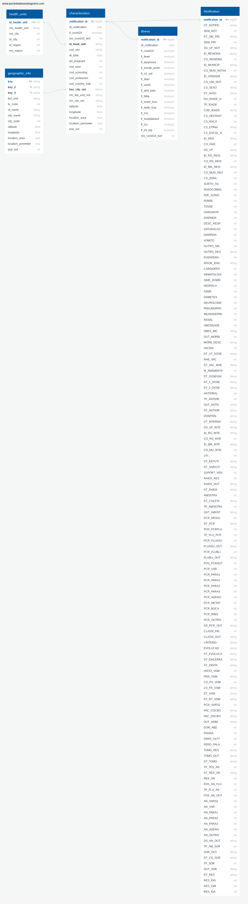

<p align="center">
  <a href="" rel="noopener">
 </a>
</p>

<h3 align="center">Brazil COVID-19 Hospitalar Notifications 2020</h3>

<div align="center">

[]() [](https://github.com/lkellermann/covid19br/issues) [](https://github.com/lkellermann/covid19br/pulls) [](/LICENSE)

</div>

---

<center> </center>
<p align="center"> Build several tables related to COVID-19 notifications  in Brazil in 2020 from public datasets provided by Brazilian Federal Government Organizations.
    <br> 
</p>

---
## 📝 Table of Contents <a name = "toc"></a>
- [About](#about)
- [About the data](#about-data)
  - [Geographical datasets](#geo-data)
  - [Patient datasets](#patient-data)
  - [Entity relationship diagram](#erd)
- [Getting Started](#getting_started)
  - [Pre-requisites](#prereq)
  - [Installing](#installing)
- [Which questions can I answer?](#which_q)
- [What if...?](#whatif)
- [Built Using](#built_using)

- [Authors](#authors)


## About <a name = "about"></a>
<sup>[ 📝 Table of Contents](#toc)</sup>

The Coronavirus Disease 2019, shortly named COVID-19, is a contagious diseased caused by the SARS-CoV-2 virus. The first known case was reported in Wuhan, China, in December 2019. Since then the disease is spreading worldwide leading it to be classified as an [ongoing pandemic](https://www.who.int/director-general/speeches/detail/who-director-general-s-opening-remarks-at-the-media-briefing-on-covid-19---11-march-2020) by World Health Organization (WHO) in March 2020.

Despite [WHO's recommendations](https://www.who.int/emergencies/diseases/novel-coronavirus-2019/advice-for-public) to people and governments in order to slow down the contamination rate, there were not standard actions to fight against the disease. Some governments who followed the WHO recommendations, such as [New Zealand](https://coronavirus.jhu.edu/region/new-zealand), had reported small number of cases and deaths. On the other hand, there were [governments who activelly fought against its population](https://www.bbc.com/news/world-latin-america-56765150) minimizing the disease effects and spreaded fake news about it had several problems. [Brazil](https://coronavirus.jhu.edu/region/brazil) falls at this second category.

In this project we are crossing hospitalization data containing some charateristics of the patient reported on a notification report and geographical data such as city coordinates, city area and estimated population. This project uses data from the year 2020 but the patients reports are still being updated in 2021 as new discoveries are done.

## About the data <a name = "about-data"></a>
<sup>[ 📝 Table of Contents](#toc)</sup>

In this project we have two kinds of data: the geographical related and the patient related.

### Geographical datasets <a name = "geo-data"></a>
<sup>[ 📝 Table of Contents](#toc)</sup>
The geographical information in this datasets allow an analysis about the effects of the area, perimeter and population size, at city level, in the number of hospitalization notifications.

#### `geo_info.csv` dataset
<sup>[ 📝 Table of Contents](#toc)</sup>

This dataset comes from a shape file provided by the brazilian Institute for Applied Economic Research (IPEA). The data was converted in tabular form by [QGIS](https://qgis.org/), calculating the city centroids, getting its coordinates and calculating each city area and perimeter in degree-units. The projection standard addopted here was the [EPSG:4618-SAD69](https://epsg.io/4618)
| Column                             | Description                                                                                                                                                     | Source                                              |
| ---------------------------------- | --------------------------------------------------------------------------------------------------------------------------------------------------------------- | --------------------------------------------------- |
| `key` (string)                     | Concatenated strings where the first two letters are the initials of an federative unit and the following letters is the non-ascii characteres in the city name | [IPEA](https://www.ipea.gov.br/ipeageo/malhas.html) |
| `NOME_UF` (string)                 | Federative Unit initials.                                                                                                                                       | [IPEA](https://www.ipea.gov.br/ipeageo/malhas.html) |
| `CODIGO_UF`(float)                 | Federative unit code.                                                                                                                                           | [IPEA](https://www.ipea.gov.br/ipeageo/malhas.html) |
| `xcoord` (float)                   | Estimated city's centroid Latitude.                                                                                                                             | [IPEA](https://www.ipea.gov.br/ipeageo/malhas.html) |
| `ycoord` (float)                   | Estimated city's centroid Longitude.                                                                                                                            | [IPEA](https://www.ipea.gov.br/ipeageo/malhas.html) |
| `area_perimeter_area` (float)      | Estimated city's area in square degree.                                                                                                                         | [IPEA](https://www.ipea.gov.br/ipeageo/malhas.html) |
| `area_perimeter_perimeter` (float) | Estimated city's perimeter in degrees.                                                                                                                          | [IPEA](https://www.ipea.gov.br/ipeageo/malhas.html) |

The files to generate this dataset is in the `mesh`subdirectory.

#### `POP2020_20210331.xls`
<sup>[ 📝 Table of Contents](#toc)</sup>
This dataset is provided by the Brazilian Institute of Geography and Statistics (IBGE) and contains information about populational estimatives by city in 2020.

| Column                        | Description                    | Source                                                                                                          |
| ----------------------------- | ------------------------------ | --------------------------------------------------------------------------------------------------------------- |
| `UF` (string)                 | Federative unit initials.      | [IBGE](https://www.ibge.gov.br/estatisticas/sociais/populacao/9103-estimativas-de-populacao.html?=&t=downloads) |
| `COD. UF` (string)            | Federative unit initials.      | [IBGE](https://www.ibge.gov.br/estatisticas/sociais/populacao/9103-estimativas-de-populacao.html?=&t=downloads) |
| `COD. MUNIC` (string)         | City code.                     | [IBGE](https://www.ibge.gov.br/estatisticas/sociais/populacao/9103-estimativas-de-populacao.html?=&t=downloads) |
| `NOME DO MUNICÍPIO` (string)  | City name.                     | [IBGE](https://www.ibge.gov.br/estatisticas/sociais/populacao/910)                                              |
| `POPULAÇÃO ESTIMADA` (string) | Population estimative in 2020. | [IBGE](https://www.ibge.gov.br/estatisticas/sociais/populacao/910)                                              |

#### `RELATORIO_DTB_BRASIL_DISTRITO.xls` (`Notification` staging table )
<sup>[ 📝 Table of Contents](#toc)</sup>

This dataset is provided by the Brazilian Institute of Geography and Statistics (IBGE) and contains details aboutl the structural territorial organization of Brazil.

| Column                                 | Description            | Source                                                                                                       |
| -------------------------------------- | ---------------------- | ------------------------------------------------------------------------------------------------------------ |
| `UF` (int)                             | Federative unit code.  | [IBGE](https://geoftp.ibge.gov.br/organizacao_do_territorio/estrutura_territorial/divisao_territorial/2020/) |
| `Mesoregião geográfica` (string)       | Mesoregion code.       | [IBGE](https://geoftp.ibge.gov.br/organizacao_do_territorio/estrutura_territorial/divisao_territorial/2020/) |
| `Nome_Mesoregião` (string)             | Mesoregion name.       | [IBGE](https://geoftp.ibge.gov.br/organizacao_do_territorio/estrutura_territorial/divisao_territorial/2020/) |
| `Microrregião Geográfica` (string)     | Microregion code.      | [IBGE](https://geoftp.ibge.gov.br/organizacao_do_territorio/estrutura_territorial/divisao_territorial/2020/) |
| `Nome_Microrregião` (string)           | Microregion name.      | [IBGE](https://geoftp.ibge.gov.br/organizacao_do_territorio/estrutura_territorial/divisao_territorial/2020/) |
| `Município` (string)                   | Partial city code.     | [IBGE](https://geoftp.ibge.gov.br/organizacao_do_territorio/estrutura_territorial/divisao_territorial/2020/) |
| `Código Município Completo` (string)   | Full city code.        | [IBGE](https://geoftp.ibge.gov.br/organizacao_do_territorio/estrutura_territorial/divisao_territorial/2020/) |
| `Nome_Município` (string)              | City name.             | [IBGE](https://geoftp.ibge.gov.br/organizacao_do_territorio/estrutura_territorial/divisao_territorial/2020/) |
| `Distrito` (string)                    | Partial district code. | [IBGE](https://geoftp.ibge.gov.br/organizacao_do_territorio/estrutura_territorial/divisao_territorial/2020/) |
| `Código de Distrito Completo` (string) | Full district code.    | [IBGE](https://geoftp.ibge.gov.br/organizacao_do_territorio/estrutura_territorial/divisao_territorial/2020/) |
| `Nome_Distrito` (string)               | District name.         | [IBGE](https://geoftp.ibge.gov.br/organizacao_do_territorio/estrutura_territorial/divisao_territorial/2020/) |

### The `uf_brazil.csv` dimension table
<sup>[ 📝 Table of Contents](#toc)</sup>
This is a small dataset written by hand containing the following columns:
| Column          | Description               | Source                           |
| --------------- | ------------------------- | -------------------------------- |
| `code_uf` (int) | Federative unit code.     | [IBGE](https://www.ibge.gov.br/) |
| `uf_name` (int) | Federative unit name.     | [IBGE](https://www.ibge.gov.br/) |
| `uf` (int)      | Federative unit initials. | [IBGE](https://www.ibge.gov.br/) |

#### `geographic_info` dimension table
<sup>[ 📝 Table of Contents](#toc)</sup>
The `geographic_info` dimension table is generated by joining and transforming the data related to the geographic-related datasets mentioned above.

| Column                       | Description                                                                                                                                                | Source                 |
| ---------------------------- | ---------------------------------------------------------------------------------------------------------------------------------------------------------- | ---------------------- |
| `key` (string)               | Key value where the first two characteres is the federative unit initials and the following characteres are the city name without non-`ascii` characteres. | `POP2020_20210331.xls` |
| `key_2` (string)             | Key value composed by the federative unit name and city name without the non-`ascii` characteres.                                                          | `geo_info.csv`         |
| `key_3` (string)             | Key value composed by the federative unit name and city name with non-`ascii` characteres replaced by `ascii`characteres.                                  | `geo_info.csv`         |
| `fed_unit` (string)          | Federative unit initials.                                                                                                                                  | `POP2020_20210331.xls` |
| `fu_code` (int)              | Federative unit initials.                                                                                                                                  | `geo_info.csv`         |
| `uf_name` (string)           | Federative unit name.                                                                                                                                      | `uf_brazil.csv`        |
| `city_name` (string)         | City name.                                                                                                                                                 | `POP2020_20210331.xls` |
| `city_code` (string)         | City code.                                                                                                                                                 | `POP2020_20210331.xls` |
| `latitude` (float)           | City centroid latitude.                                                                                                                                    | `geo_info.csv`         |
| `longitude` (float)          | City centroid longitude.                                                                                                                                   | `geo_info.csv`         |
| `location_area` (float)      | City area.                                                                                                                                                 | `geo_info.csv`         |
| `location_perimeter` (float) | City perimeter.                                                                                                                                            | `geo_info.csv`         |
| `pop_est` (float)            | Estimated population size.                                                                                                                                 | `POP2020_20210331.xls` |


### Patient dataset <a name = "patient-data"></a>
<sup>[ 📝 Table of Contents](#toc)</sup>

The patient-related dataset contain a more details that are covered in the documentation at `input/notification/data-docs/`subdirectory. Here we will focuses only on the final tables and its source. These information comes from file [`INFLUD-05-04-2021.csv`](https://opendatasus.saude.gov.br/dataset/bd-srag-2020/resource/d89ea107-4a2b-4bd5-8b8b-fa1caaa96550) provided by Brazilian Health Ministry which contains hospitalized patient data in Brazil at 2020. All columns sources in the tables below comes from this table.


#### `health_units` dimension table
<sup>[ 📝 Table of Contents](#toc)</sup>
This table contains informations about the health unit where a patient is hospitalized.

| Column                    | Description                              | Column Source |
| ------------------------- | ---------------------------------------- | ------------- |
| `id_health_unit` (int)    | Health unit identification number.       | `CO_UNI_NOT`  |
| `nm_health_unit` (string) | Health unit name.                        | `ID_UNIDADE`  |
| `nm_city` (string)        | City name where the health unit is in.   | `ID_MUNICIP`  |
| `id_city` (int)           | City code where the health unit is in.   | `CO_MUN_NOT`  |
| `id_region` (float)       | Region code where the health unit is in. | `CO_REGIONA`  |
| `nm_region` (float)       | Region name where the health unit is in. | `ID_REGIONA`  |

#### `characteristics` fact table
<sup>[ 📝 Table of Contents](#toc)</sup>
This table contains information about the patient's characteristics.

| Column                         | Description                                                                    | Column Source                   |
| ------------------------------ | ------------------------------------------------------------------------------ | ------------------------------- |
| `notification_id` (int)        | Notification code generated by `monotonically_increasing_id()` `Spark` method. | `monotonically_increasing_id()` |
| `dt_notification` (date)        | Notification date. | `DT_NOTIFIC` |
| `fl_covid19` (boolean)        | If is suspicious the patient has COVID-19 (`True`) or not (`False`). | `SURTO_SG` |
| `res_covid19_test` (int)        | Result of COVID-19 test. | `RES_IGG` |
| `id_health_unit_notific` (int) | Health unit code.                                                              | `CO_UNI_NOT`                    |
| `cod_sex` (string)             | Patient sex code.                                                              | `CS_SEXO`                       |
| `dt_birth` (date)         | Patient date of birth.                                                         | `DT_NASC`                       |
| `qrt_pregnant` (int)           | Quarter of pregnancy.                                                          | `CS_GESTANT`                    |
| `cod_race` (int)               | Code of race.                                                                  | `CS_RACA`                       |
| `cod_schooling` (int)          | Patient schooling code.                                                        | `CS_ESCOL_N`                    |
| `cod_profession` (int)         | Patient profession code.                                                       | `PAC_DSCBO`                     |
| `key_city_not` (int)           | Foreign key to join city notifications with `geographic_info` dimension table                                                    | `SG_UF_NOT`, `ID_MUNICIP`                    |
|`nm_fed_unit_not` (string)        | Federal unit name where the notification was registered | `SG_UF_NOT`|

| `nm_city_not` (int)           |  Name of the city where the notification was registered                                                     | `ID_MUNICIP`                    |
| `cod_country_hab` (int)        | Patient living country code.                                                   | `CO_PAIS`                       |

#### `illness` fact table
<sup>[ 📝 Table of Contents](#toc)</sup>
This table contains information about diagnostics of some illness the patient has.
| Column                   | Description                                                                                      | Column Source |
| ------------------------ | ------------------------------------------------------------------------------------------------ | ------------- 
| `notification_id` (int)        | Notification code generated by `monotonically_increasing_id()` `Spark` method. | `monotonically_increasing_id()` 
| `fl_covid19` (bool)      | Flag that identifies if the problems are related to COVID-19 (`True`) or not (`False`).          | `SURTO_SG`    |
| `fl_fever` (bool)        | Flag that identifies if the patient has fever (`True`) or not (`False`).                         | `FEBRE`       |
| `fl_dyspnoea` (bool)     | Flag that identifies if the patient has dyspnoea (`True`) or not (`False`).                      | `DISPNEIA`    |
| `fl_breath_probl` (bool) | Flag that identifies if the patient has any breath difficulties (`True`) or not (`False`).       | `DESC_RESP`   |
| `fl_o2_sat` (bool)       | Flag that identifies if the patient has blood O2 saturation (`True`) or not (`False`).           | `SATURACAO`   |
| `fl_diarr` (bool)        | Flag that identifies if the patient has diarrhea (`True`) or not (`False`).                      | `DIARREIA`    |
| `fl_vomit` (bool)        | Flag that identifies if the patient is puking (`True`) or not (`False`).                         | `VOMITO`      |
| `fl_abd_pain` (bool)     | Flag that identifies if the patient has abdominal pain (`True`) or not (`False`).                | `DOR_ABD`     |
| `fl_fatig` (bool)        | Flag that identifies if the patient has fatigue (`True`) or not (`False`).                       | `FADIGA`      |
| `fl_smell_loss` (bool)   | Flag that identifies if the patient has smell loss (`True`) or not (`False`).                    | `PERD_OLFT`   |
| `fl_taste_loss` (bool)   | Flag that identifies if the patient has taste loss (`True`) or not (`False`).                    | `PERD_PALA`   |
| `fl_hospitalized` (bool) | Flag that identifies if the patient needs to be hospitalized (`True`) or not (`False`).          | `HOSPITAL`    |
| `fl_icu` (bool)          | Flag that identifies if the patient needs to go to inencive care unit (`True`) or not (`False`). | `UTI`         |
| `fl_int_trip` (bool)     | Flag that identifies if the patient went abroad recently (`True`) or not (`False`).              | `HISTO_VGM`   |
| `res_covid19_test` (int) | Code of the sorological COVID-19 test.                                                           | `RES_IGG`     |
### Entity Relationship Diagram <a name = "erd"></a>
<sup>[ 📝 Table of Contents](#toc)</sup>  
<p align="center">
  <a href="" rel="noopener">
 </a>
</p>


## 🏁 Getting Started <a name = "getting_started"></a>

### Prerequisites <a name = "prereq"></a>
<sup>[ 📝 Table of Contents](#toc)</sup>
To execute this project you'll need a `dl.cfg` file containing an AWS access and secret ID for an IAM User role with permissions of write and read an `S3` bucket. The content of this file must be in the following format:

```text
[AWS]
AWS_ACCESS_KEY_ID=A******************5
AWS_SECRET_ACCESS_KEY=E**************************************S
```

You will need to install [`Python 3.7.6`](https://www.python.org/downloads/release/python-376/) with `PySpark 2.4.3` installed. After installing `Python`, you can install `PySpark` by running the following command:

```powershell
pip install pyspark==2.4.3
```
> * In order to run `PySpark 2.4.3`, you will need to install [`Java JDK 8`](https://www.oracle.com/br/java/technologies/javase/javase-jdk8-downloads.html). 
> * We strongly recomment to use a specific virtual environment in Python to execute this project. Click [here](https://docs.python.org/3/tutorial/venv.html) to know more about virtual environments in Python or [here](https://docs.conda.io/projects/conda/en/latest/user-guide/tasks/manage-environments.html) to know more about virtual environments in Anaconda.

You should also install all other packages listed on `requirements.txt` file in order to emulate the same `Python` environment this project was developed. You can do this by running:
```
pip install -r requirements.txt
```
### Installing <a name = "installing"></a>
<sup>[ 📝 Table of Contents](#toc)</sup>

To execute this project you only need to download this repository, activate the virtual environment with `Python 3.7.6` and `PySpark 2.4.3` in it and run the following command:
```
python lake.py
```
> * You can run this code in test mode without accessing a `S3`bucket. To do this you just have to uncomment the lines `478` and `479` and comment the lines `469` to `476` in `lake.py`.
> * The test files are in `input` and `output` subirectories in this repository.

After a few seconds you should see the following lines in your command line:
```
        0 artifacts copied, 70 already retrieved (0kB/20ms)
YY/MM/DD HH:MM:SS WARN Utils: Your hostname, username resolves to a loopback address: XXX.X.X.X; using XXX.XXX.X.X instead (on interface wlp3s0)
YY/MM/DD HH:MM:SS WARN Utils: Set SPARK_LOCAL_IP if you need to bind to another address
YY/MM/DD HH:MM:SS WARN NativeCodeLoader: Unable to load native-hadoop library for your platform... using builtin-java classes where applicable
Using Spark's default log4j profile: org/apache/spark/log4j-defaults.properties
Setting default log level to "WARN".
To adjust logging level use sc.setLogLevel(newLevel). For SparkR, use setLogLevel(newLevel).
```

If the file was successfully finished you should see a sample of the final table:
```
--------+------------------+--------+
-------------+------------------+-------+
|notification_id|dt_notification|fl_covid19|res_covid19_test|id_health_unit|cod_sex|  dt_birth|qrt_pregnant|cod_race|cod_schooling|cod_profession|cod_country_hab|key_city_not|nm_fed_unit_not|fu_code_not|nm_city_not| latitude| longitude|location_area|location_perimeter|pop_est|
+---------------+---------------+----------+----------------+--------------+-------+----------+------------+--------+-------------+--------------+---------------+------------+---------------+-----------+-----------+---------+----------+-------------+------------------+-------+
|             90|     2019-12-29|     false|            null|       2372967|      F|1989-12-31|           5|       2|            1|          null|              1|   cearacati|             CE|         23|    Aracati|-37.68638|-4.6802797|   0.10000686|         2.1396823|  74975|
|           5295|     2019-12-29|      true|            null|       2372967|      F|1969-12-28|           5|       4|            0|          null|              1|   cearacati|             CE|         23|    Aracati|-37.68638|-4.6802797|   0.10000686|         2.1396823|  74975|
|          11807|     2019-12-29|     false|            null|       2372967|      M|1953-12-27|           6|       4|            2|          null|              1|   cearacati|             CE|         23|    Aracati|-37.68638|-4.6802797|   0.10000686|         2.1396823|  74975|
|          14341|     2019-12-29|     false|               2|       2372967|      M|1964-12-27|           6|       1|            1|          null|              1|   cearacati|             CE|         23|    Aracati|-37.68638|-4.6802797|   0.10000686|         2.1396823|  74975|
|          16768|     2019-12-29|     false|            null|       2372967|      M|1937-12-26|           6|       4|            1|          null|              1|   cearacati|             CE|         23|    Aracati|-37.68638|-4.6802797|   0.10000686|         2.1396823|  74975|
+---------------+---------------+----------+----------------+--------------+-------+----------+------------+--------+-------------+--------------+---------------+------------+---------------+-----------+-----------+---------+----------+-------------+------------------+-------+

```

And you should also see the results of the quality checks:
```
############
Running quality check for output/health_units:
Number of rows and columns: (6675,6)                                            
############

############
Running quality check for output/illness:
Number of rows and columns: (1189742,18)
############

############
Running quality check for output/geographic_info/*/*.parquet:
Number of rows and columns: (16671,17)                                          
############

############
Running quality check for output/characteristics:
Number of rows and columns: (1181724,21)                                        
############
```
> In this quality check is important to notice that `characteristics` table can't be greater than the `illness` table. However the dataset can be smaller because of the `inner join` with `geographical_info` dataset. Unfurtunatelly there is no standardization between government city databases and the COVID-19 Notifications databases.


## :question: Which questions can I answer? <a name = "which_q"></a>
<sup>[ 📝 Table of Contents](#toc)</sup>
The following questions can be answered with the `characteristics` table:
- How many COVID-19 notifications we have per...
  - City.
  - State. 
  - Health Unit.
- Are pregnant women are more susceptible to have COVID-19? If yes, at which quarter?
- Has the schooling degree, profession or age any relation with the COVID-19 cases?
## :thinking: What if... <a name = "whatif"></a>

### ... the data is increased by 100x?
<sup>[ 📝 Table of Contents](#toc)</sup>

This project uses Spark as an engine to process the data and was tested with 450 MB of data input. Spark alocates data in memory to run it's calculations and in situations we are running out off memory the engine will [persist the data in disk](https://spark.apache.org/docs/2.4.3/rdd-programming-guide.html#rdd-persistence). 

Spark works with resilient distributed datasets (RDD) that are well suited to work in big data scenarios. So we don't need to worry about the programming.

Only the `POP2020_20210331.xls` input data could increase by 100x. The others input files doesn't grow because this would mean that the number of cities and federative units were increased by 100x. In these static datasets (`geo_info.csv`,`RELATORIO_DTB_BRASIL_DISTRITO.xls`, `uf_brazil.csv`) we are OK to work with non-big data tools.

### ... I need to run the script periodicallly?
<sup>[ 📝 Table of Contents](#toc)</sup>
If you need to run this script daily at an unpleasent time (like 3AM) you could automate the execution by using the task scheduler of your system or other software you have on your machine **after** running a script that update your source file `POP2020_20210331.xls` or replace it with the same information. The `lake.py` script only transform and load the data from a given source directory, but it doesn't update the files in this source directory.

### ... 100+ people need to access the database at the same time?
<sup>[ 📝 Table of Contents](#toc)</sup>
[Amazon S3](https://www.amazonaws.cn/en/s3/features/) can support many parallel connections and it scales on demand. So there's no problem.


## ⛏️ Built Using <a name = "built_using"></a>

- [PySpark](https://spark.apache.org/docs/2.4.3/) - Cluster computing system. Good tool to process big datasets.
- [QGis](https://qgis.org/en/site/) - A Free and Open Source Geographic Information System. Good tool to work with shape files.
- [Pandas](https://pandas.pydata.org/) - Good tool analyze small datasets in Python.
- [Python](https://www.python.org/) - General purpose programming language.
- [Quick Database Diagrams](https://app.quickdatabasediagrams.com/#/) - Tool to create entity relationship diagrams.
## ✍️ Authors <a name = "authors"></a>

- [@lkellermann](https://github.com/lkellermann) - Idea & Initial work

